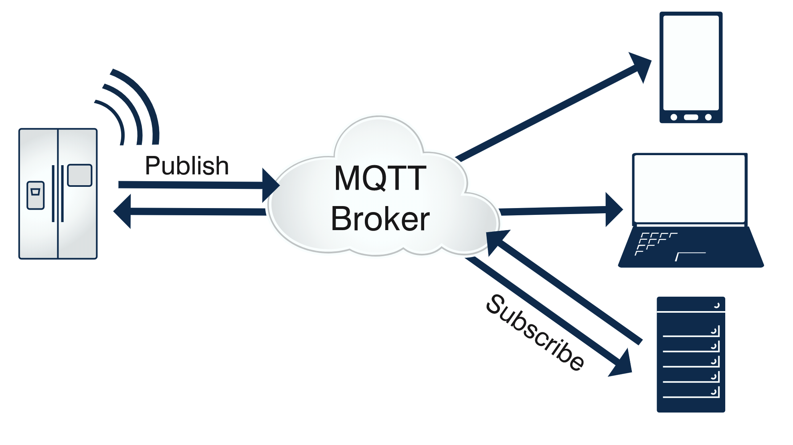
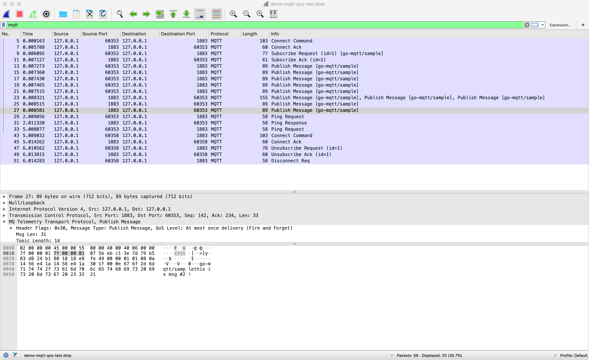
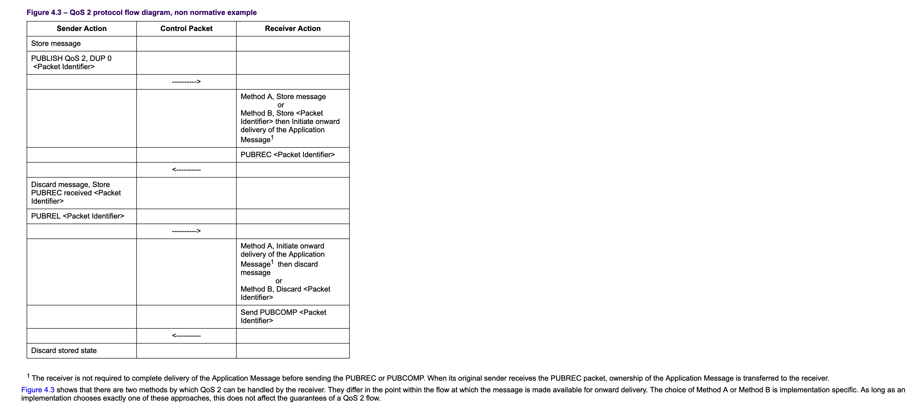

本项目是个人学习MQTT协议过程中的实验项目。

## MQTT简述

> MQTT（Message Queuing Telemetry Transport，消息队列遥测传输协议），是一种基于发布/订阅（publish/subscribe）模式的"轻量级"通讯协议，该协议构建于TCP/IP协议上，由IBM在1999年发布。MQTT最大优点在于，可以以极少的代码和有限的带宽，为连接远程设备提供实时可靠的消息服务。作为一种低开销、低带宽占用的即时通讯协议，使其在物联网、小型设备、移动应用等方面有较广泛的应用。
>
> MQTT是一个基于客户端-服务器的消息发布/订阅传输协议。MQTT协议是轻量、简单、开放和易于实现的，这些特点使它适用范围非常广泛。在很多情况下，包括受限的环境中，如：机器与机器（M2M）通信和物联网（IoT）。其在，通过卫星链路通信传感器、偶尔拨号的医疗设备、智能家居、及一些小型化设备中已广泛使用。



从上面的架构图来看，MQTT其实跟传统的MQ很像，也是消息队列。但MQTT协议工作在低带宽、不可靠的网络的远程传感器和控制设备通讯而设计的协议，跟传统MQ相比，它具有以下主要的几项特性：

> （1）使用发布/订阅消息模式，提供一对多的消息发布，解除应用程序耦合。
>  
>  这一点很类似于XMPP，但是MQTT的信息冗余远小于XMPP，,因为XMPP使用XML格式文本来传递数据。
>  
>  （2）对负载内容屏蔽的消息传输。
>  
>  （3）使用TCP/IP提供网络连接。
>  
>  主流的MQTT是基于TCP连接进行数据推送的，但是同样有基于UDP的版本，叫做MQTT-SN。这两种版本由于基于不同的连接方式，优缺点自然也就各有不同了。
>  
>  （4）有三种消息发布服务质量：
>  
>  "至多一次"，消息发布完全依赖底层TCP/IP网络。会发生消息丢失或重复。这一级别可用于如下情况，环境传感器数据，丢失一次读记录无所谓，因为不久后还会有第二次发送。这一种方式主要普通APP的推送，倘若你的智能设备在消息推送时未联网，推送过去没收到，再次联网也就收不到了。
>  
>  "至少一次"，确保消息到达，但消息重复可能会发生。
>  
>  "只有一次"，确保消息到达一次。在一些要求比较严格的计费系统中，可以使用此级别。在计费系统中，消息重复或丢失会导致不正确的结果。这种最高质量的消息发布服务还可以用于即时通讯类的APP的推送，确保用户收到且只会收到一次。
>  
>  （5）小型传输，开销很小（固定长度的头部是2字节），协议交换最小化，以降低网络流量。
>  
>  这就是为什么在介绍里说它非常适合"在物联网领域，传感器与服务器的通信，信息的收集"，要知道嵌入式设备的运算能力和带宽都相对薄弱，使用这种协议来传递消息再适合不过了。
>  
>  （6）使用Last Will和Testament特性通知有关各方客户端异常中断的机制。
>  
>  Last Will：即遗言机制，用于通知同一主题下的其他设备发送遗言的设备已经断开了连接。
>  
>  Testament：遗嘱机制，功能类似于Last Will。

## 快速入门

可以运行以下命令快速体验一下MQTT的功能。

运行MQTT Broker：

```bash
make start-mqtt-broker
```

运行MQTT Client：
```bash
make start-mqtt-client
```

## MQTT协议原理

本节内容基本是从`https://www.runoob.com/w3cnote/mqtt-intro.html`得来，这里将MQTT协议的核心概念介绍得比较清楚了，对照下`cmd/simple.go`的源码可以理解得更深刻。

### MQTT协议实现方式

实现MQTT协议需要客户端和服务器端通讯完成，在通讯过程中，MQTT协议中有三种身份：发布者（Publish）、代理（Broker）（服务器）、订阅者（Subscribe）。其中，消息的发布者和订阅者都是客户端，消息代理是服务器，消息发布者可以同时是订阅者。

MQTT传输的消息分为：主题（Topic）和负载（payload）两部分：

* Topic，可以理解为消息的类型，订阅者订阅（Subscribe）后，就会收到该主题的消息内容（payload）；
* payload，可以理解为消息的内容，是指订阅者具体要使用的内容。

### 网络传输与应用消息

MQTT会构建底层网络传输：它将建立客户端到服务器的连接，提供两者之间的一个有序的、无损的、基于字节流的双向传输。

当应用数据通过MQTT网络发送时，MQTT会把与之相关的服务质量（QoS）和主题名（Topic）相关连。

### MQTT客户端
一个使用MQTT协议的应用程序或者设备，它总是建立到服务器的网络连接。客户端可以：

* 发布其他客户端可能会订阅的信息；
* 订阅其它客户端发布的消息；
* 退订或删除应用程序的消息；
* 断开与服务器连接。

### MQTT服务器

MQTT服务器以称为"消息代理"（Broker），可以是一个应用程序或一台设备。它是位于消息发布者和订阅者之间，它可以：

* 接受来自客户的网络连接；
* 接受客户发布的应用信息；
* 处理来自客户端的订阅和退订请求；
* 向订阅的客户转发应用程序消息。

### MQTT协议中的订阅、主题、会话

#### 订阅（Subscription）

订阅包含主题筛选器（Topic Filter）和最大服务质量（QoS）。订阅会与一个会话（Session）关联。一个会话可以包含多个订阅。每一个会话中的每个订阅都有一个不同的主题筛选器。

#### 会话（Session）

每个客户端与服务器建立连接后就是一个会话，客户端和服务器之间有状态交互。会话存在于一个网络之间，也可能在客户端和服务器之间跨越多个连续的网络连接。

#### 主题名（Topic Name）

连接到一个应用程序消息的标签，该标签与服务器的订阅相匹配。服务器会将消息发送给订阅所匹配标签的每个客户端。

#### 主题筛选器（Topic Filter）

一个对主题名通配符筛选器，在订阅表达式中使用，表示订阅所匹配到的多个主题。

#### 负载（Payload）

消息订阅者所具体接收的内容。

### MQTT协议中的方法

MQTT协议中定义了一些方法（也被称为动作），来于表示对确定资源所进行操作。这个资源可以代表预先存在的数据或动态生成数据，这取决于服务器的实现。通常来说，资源指服务器上的文件或输出。主要方法有：

* Connect。等待与服务器建立连接。
* Disconnect。等待MQTT客户端完成所做的工作，并与服务器断开TCP/IP会话。
* Subscribe。等待完成订阅。
* UnSubscribe。等待服务器取消客户端的一个或多个topics订阅。
* Publish。MQTT客户端发送消息请求，发送完成后返回应用程序线程。

## MQTT协议数据包分析

要分析一个协议，最重要的是分析其协议数据包的格式及含义。[MQTT控制报文格式](https://mcxiaoke.gitbooks.io/mqtt-cn/content/mqtt/02-ControlPacketFormat.html)已有很详细的文档。
MQTT协议也算是比较简单的，只有14种类型的控制报文，每种控制报文发挥的作用及细节参见[这里](https://mcxiaoke.gitbooks.io/mqtt-cn/content/mqtt/03-ControlPackets.html)。

按我的经验，这样直接看协议文档很难理解清楚。更好的办法抓包，并结合文档分析理解。抓包分析方法如下：

```bash
# 启动tcpdump进行抓包，程序运行完毕后按Ctrl+C结束抓包
make dump-mqtt-packet

# 运行MQTT Broker
make start-mqtt-broker
  
# 运行MQTT Client：
make start-mqtt-client
```

将得到的dmp文件，使用`wireshark`打开，再用`mqtt`协议过滤规则过滤一下，就可以很清楚地看到MQTT的数据包了，如下图：



大概看了下各类型的数据包，果然是相当的精练，基本找不到信息冗余。

看看[英文原版的协议规范](http://docs.oasis-open.org/mqtt/mqtt/v3.1.1/mqtt-v3.1.1.html)也挺好的。

## MQTT Broker的选择

对Go语言熟悉一点，同时为了学习下高性能网络编程的代码，本示例使用的是一款高性能的`MQTT Broker`[volantmq](https://github.com/VolantMQ/volantmq)，其具备的功能已经很丰富了，应付大部分应用场景也够用。

但面对大量设备的IoT场景，还是要考虑集群形式部署以进行水平扩展，参考[wikipedia上的对比资料](https://en.wikipedia.org/wiki/Comparison_of_MQTT_implementations)，还是比较推荐[emqx](https://github.com/emqx/emqx)和[vernemq](https://github.com/vernemq/vernemq)。这个两个都是利用`Erlang/OTP`实现的，看来在消息队列领域`Erlang/OTP`果真是利器啊！`Erlang/OTP分布式编程`的简要说明可以参考[这里](https://docs.emqx.io/broker/v3/cn/cluster.html#erlang-otp)。

## MQTT Client Library的选择

本示例使用的是github上star数较多的MQTT Golang Client Library - [paho.mqtt.golang](https://github.com/eclipse/paho.mqtt.golang)，其使用还是很方便的，源码里还有一些[高级用法的示例](https://github.com/eclipse/paho.mqtt.golang/tree/master/cmd)。

这里还有一个[比较全面的Client Library列表](https://github.com/mqtt/mqtt.github.io/wiki/libraries)，可以根据所使用的语言，Client Library支持的特性、成熟度等因素找到一款适合的Client Library。

## MQTT使用上一些特殊玩法

### MQTT基于主题(Topic)消息路由

MQTT协议基于主题(Topic)进行消息路由，主题(Topic)类似URL路径，例如:

```
chat/room/1
sensor/10/temperature
sensor/+/temperature
$SYS/broker/metrics/packets/received
$SYS/broker/metrics/#
```

主题(Topic)通过`/`分割层级，支持`+`, `#`通配符:

```
`+`: 表示通配一个层级，例如a/+，匹配a/x, a/y
`#`: 表示通配多个层级，例如a/#，匹配a/x, a/b/c/d
```

订阅者与发布者之间通过主题路由消息进行通信，例如采用mosquitto命令行发布订阅消息:

```
mosquitto_sub -t a/b/+ -q 1
mosquitto_pub -t a/b/c -m hello -q 1
```

订阅者可以订阅含通配符主题，但发布者不允许向含通配符主题发布消息。

### MQTT消息QoS

MQTT发布消息QoS保证不是端到端的，是客户端与服务器之间的。订阅者收到MQTT消息的QoS级别，最终取决于发布消息的QoS和主题订阅的QoS，简单说就是发布消息的QoS和主题订阅的QoS两者间的较小值。

Qos0消息发布订阅


Qos1消息发布订阅


Qos2消息发布订阅



可以看到为了满足越来越高的QoS，消息传递过程增加了很多保障性的控制指令。

### MQTT会话自动销毁

MQTT客户端向服务器发起CONNECT请求时，可以通过`Clean Session`标志设置会话。

`Clean Session`设置为0，表示创建一个持久会话，在客户端断开连接时，会话仍然保持并保存离线消息，直到会话超时注销。

`Clean Session`设置为1，表示创建一个新的临时会话，在客户端断开时，会话自动销毁。

### MQTT遗愿消息

MQTT客户端向服务器端CONNECT请求时，可以设置是否发送遗愿消息(Will Message)标志，和遗愿消息主题(Topic)与内容(Payload)。

MQTT客户端异常下线时(客户端断开前未向服务器发送DISCONNECT消息)，MQTT消息服务器会发布遗愿消息。

### MQTT保留消息

MQTT客户端向服务器发布(PUBLISH)消息时，可以设置保留消息(Retained Message)标志。保留消息(Retained Message)会驻留在消息服务器，后来的订阅者订阅主题时仍可以接收该消息。

例如mosquitto命令行发布一条保留消息到主题’a/b/c’:

```
mosquitto_pub -r -q 1 -t a/b/c -m 'hello'
```

之后连接上来的MQTT客户端订阅主题’a/b/c’时候，仍可收到该消息:

```
$ mosquitto_sub -t a/b/c -q 1
hello
```

保留消息(Retained Message)有两种清除方式:

* 客户端向有保留消息的主题发布一个空消息:

```
mosquitto_pub -r -q 1 -t a/b/c -m ''
```

* 设置消息服务器的保留消息超期时间


## 参考

1. https://www.runoob.com/w3cnote/mqtt-intro.html
2. https://legacy.gitbook.com/book/mcxiaoke/mqtt-cn
3. http://docs.oasis-open.org/mqtt/mqtt/v3.1.1/mqtt-v3.1.1.html
4. https://en.wikipedia.org/wiki/Comparison_of_MQTT_implementations
5. https://docs.emqx.io/broker/v3/cn/cluster.html#erlang-otp
6. http://erlang.org/doc/reference_manual/distributed.html
7. https://kknews.cc/tech/ejya48q.html